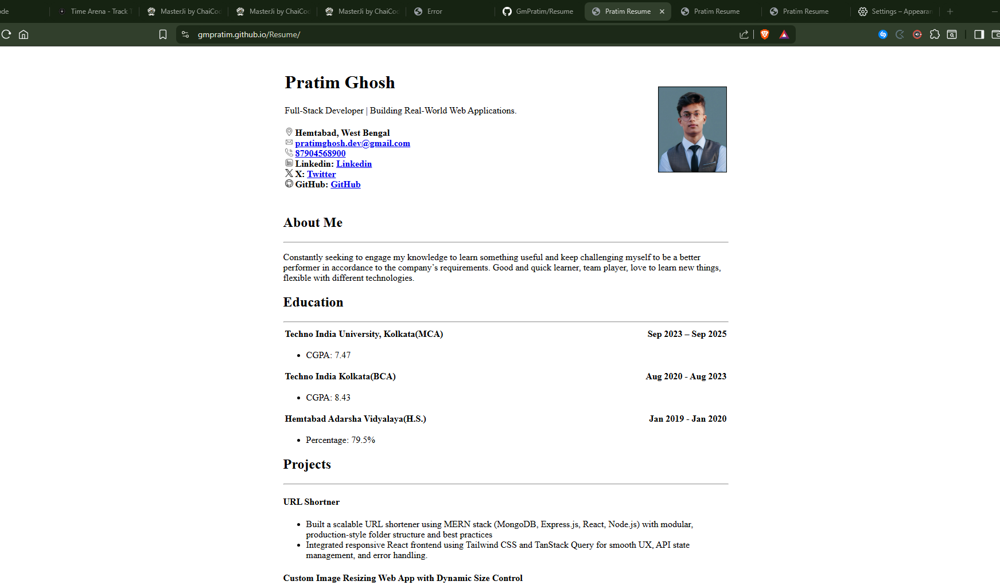
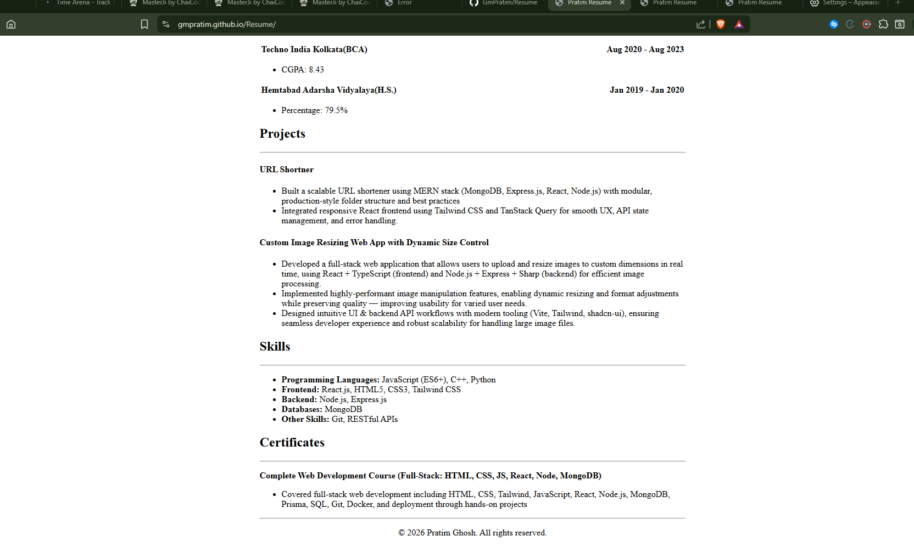

# Resume – HTML Single Page Website

This project is a **single-page resume website** built using **only HTML**

## Live Demo

👉🏻 **Website:**  
https://gmpratim.github.io/Resume/

👉🏻 **GitHub Repository:**  
https://github.com/GmPratim/Resume

## Technologies Used

- **HTML5 only**

## Features

- Single-page resume layout
- Centered PDF-style design
- Header with name, role, contact details, and profile image

- Sections included:
  - About Me
  - Education
  - Projects
  - Skills
  - Certificates

  ## How to Run Locally

1. Create a new folder on your PC.
   Then open this folder in VS Code or any other IDE.

2. Open the terminal in your IDE.

3. Clone the repository (copy the command below and paste it into the terminal):

   ```bash
   git clone https://github.com/GmPratim/Resume.git
   ```

4. Navigate to the project folder:
   ```bash
   cd Resume
   ```
5. Open index.html in any web browser.

## 📸 Screenshots preview

### Resume – Top Section



### Resume – Bottom Section


